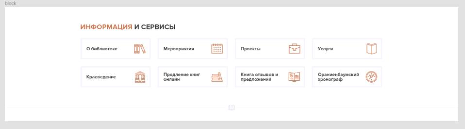

# task_html_for-Ji-Touch

### Описание приложения "task_html_for-Ji-Touch":

Реализован следующий блок в соответствии с макетом

### Основные функции приложения:

Отражает Pixel-perfect в соответствии с заданием.

Блок реализован и для мобильных устройств.

### Стек:

Использовал HTML5, CSS3, Bootstrap5

### Установка зависимостей:

Не требуется

### Запуск приложения:

Через index.html

### Что в доработке:

### P.S.:

Используемый код css минифицировал (чтоб преобразовать обратно https://www.websiteplanet.com/ru/webtools/jscssminifier/ ), но оставил исходник для наглядности.
